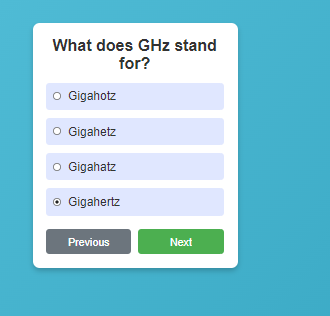

# Online Quiz Task

This project is a quiz game built using React, utilizing the **Open Trivia DB API** to fetch quiz questions. The user is presented with a series of questions, where they must select an answer for each one. Upon completing the quiz, the user can submit their answers to see their final score and review any incorrect answers.

## Features

1. **Fetch Questions from API**: Use the [Open Trivia DB API](https://opentdb.com/api.php?amount=10&category=23&difficulty=easy) to retrieve a list of quiz questions.
2. **User Answer Selection**: For each question, the user selects one answer from the available options.
3. **Score Calculation**: After submitting the quiz, the user's score is displayed, along with a review of any incorrect answers.
4. **Component Structure**: The application is structured with React components, and the state is managed using the `useContext` hook.

## Components

- **QuizComponent**: Displays the list of questions and answer choices. Users can select answers and navigate through the questions.
- **ScoreComponent**: Displays the final score and a breakdown of correct and incorrect answers after the quiz is submitted.
- **QuestionComponent**: Represents individual questions and their possible answers.

## Flow

1. The user is presented with a series of 10 questions from the API.
2. For each question, the user selects an answer.
3. After answering all questions, the user can submit the quiz.
4. The final score is shown, and the user can see which questions were answered incorrectly.

## API Used

The API used to fetch the questions is:

```bash
https://opentdb.com/api.php?amount=10&category=23&difficulty=easy
```
## Preview of the Project 

### First Question With Next Button


### Qustion With Next and Previous Button


### Result Page

